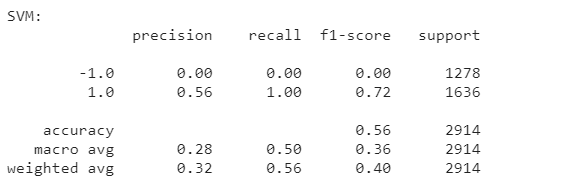
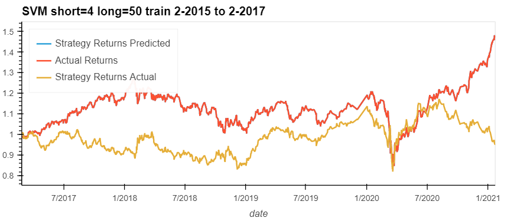
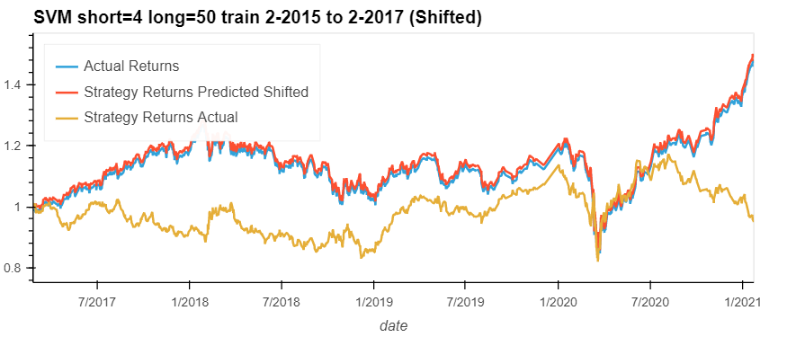
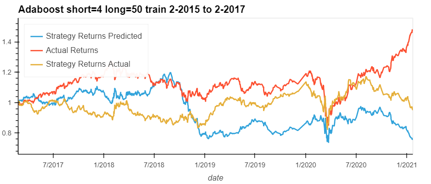
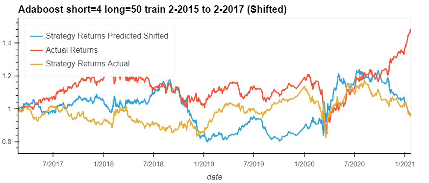

# Machine Learning Trading Bot
Machine Learning Trading Bot

## Baseline Analysis
### SVM short is 4 and long is 100.

### AdaBoost short is 4 and long is 100.

## Change Training Time period 4, 2015 to 3, 2017
### SVM short is 4 and long is 100

### Adaboost short is 4 and long is 100

## Change Long to 50 from 100 and train period is 2, 2015 to 2, 2017
### SVM short is 4 and long is 50

### Adaboost short is 4 and long is 50

