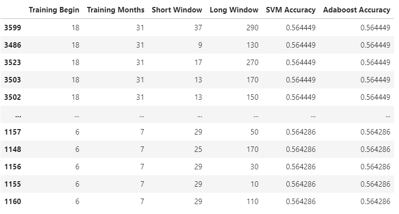

# Machine Learning Trading Bot
Machine Learning Trading Bot

We want to devise a trading strategy where we want to predict the direction of the future returns. 
If the returns are supposed to be positive then we buy and if the returns are supposed to be negative then we sell. We apply Machine Learning Algorithms to use Simple Moving Averages to predict direction of future returns.

## Baseline Analysis
* Short Simple Moving Average Window is 4 days and Long Simple Moving Average Window is 100 days.
* The training period is 30 days.

### SVM short is 4 and long is 100.
* The model has an accuracy of 0.55. 
* The strategy returns predicted follow the actual returns till late 2018
and then they deviate from the actual returns. The returns from this model exceed actual returns towards the end of the test period and this is because it was able to predict a few down events accurately in late 2018.
* It would have performed even better if it has been able to predict some more negative events. 
* It did a great job with predicting positive returns but not so much with negative returns

### AdaBoost short is 4 and long is 100.
* This model also has an overall accuracy of .55 (same as the SVM baseline mode)
* This model does a better job of predicting negative returns than SVM baseline model but at a slight expense of predicting the positive returns.
* The prediced strategy retuns follow the general actual returns trend but deviate from actual return from
late 2017 to early 2020. The returns from this model are almost the same as the actual returns towards the end of the test period. This is because it got some negative trends accurately but missed some positive events. A oversampling of the positive events may have helped the Adaboost and potentially helped it perform better than the baseline SVM. 

## Increase Training Time period to 2 years (4, 2015 to end of 3, 2017) 
* Changed the training period to 2 years. Increasing the training period helped increase the accuracy of the SVM model because of potential overfitting for the positve returns. It should have increased the possibility of detecting negative events. Only Adaboost was able to utilize this. SVM suffers from not being able to train properly on the negative events potentially because of it inherent limitations due to linearity (other kernels could be tried)
* SVM accuracy improved but its ability to predict negative returns was negligible. So This model can be rejected. A dumb model predicting 1 always would have performed the same as this model.
* Adaboost model deviates from the actual returns and ends up going in the opposite direction (lower returns than actual returns) because of it high error in predicting positive events although it does better in predicting the negative returns. It was able to use the longer time period to learn the negative events better. An oversampling of the positive events is needed to better train the Adaboost model.
* Some of the adverse performance compared to the baseline could also be as a result of a short test window. For apples to apples comparison, we should have used the same test window - perhaps last 3 years of data or something that would have been the same for both the baseline and this model.  
### SVM short is 4 and long is 100
* This model suffer from lack of predictive power related to negative returns.
* This model has an overall accuracy of .56. This is better than the baseline models but this is due to increased predictive power for positive returns and comes at an expensive of predicting negative returns.
* This model follows the actual returns till early 2020 and excels after the 2020 downturn and starts deviating from the actual returns. This is due to getting some critical negative return signal right.
* This model needs to be rejected because the recall for negative returns is 0. That means that it didn't predict any of the actual negative returns but got a lot of incorrect negatives that helped its case.

### Adaboost short is 4 and long is 100
* This model has an overall accuracy of .50. This is worse than all the previous models including baseline models.
* This model has a good balance of predictive power of postive returns and negative returns.
* This model deviates from actual returns during the pandemic crash and towards the end of test period has 
an opposite direction to the actual returns. This is probably because it differs from the baseline model in predicting the positive returns. This model can be rejected due to the face that it underperforms the actual returns. 

## Decrease Long Window to 50 from 100, Small Window is same and train period is 4, 2015 to early 4, 2017
* Decreasing the long window decreased the overall performance of both the models. 
* We need to be carefully when tuning the small and long Simple Moving Averages windows.
* We should probably do some extensive testing with various values to understand the best possible/optimal value. The value can differ based on the training and test data. So, we will have to be very careful when tuning these windows.
* The accuracy of the SVM model remained the same but its ability to detect negative return was 0 now. This is a bad sign. The model is the same as a dummy model that always predicts 1.
* Both SVM and AdaBoost resulting in lower returns than actual. So need to be rejected for that reason. They performed worse than the baseline and also the previously tuned model (longer training window)

### SVM short is 4 and long is 50
* Always predicts 1. It is as good as a dummy model that always predicts 1.
* Does not predict any negative events.
* This model needs to be rejected for this reason. Also the performance is the same as actual returns.
* Baseline SVM and longer trained SVM does better than this model. 

### Adaboost short is 4 and long is 50
* Predicts more negative returns than positive returns.
* The predicted returns is way lower than the baseline Adaboost and longer trained Adaboost
* It needs to be rejected for the above reasons.

## Test runs 
Various iterations of testing was done and the results are as follows:

Some of the models with the best SVM accuracy started the training period 18 or 6 or 12 months from the initial training data.

If we review the classification report for start after 18 months for 31 month with a short window of 37 and long window of 290, we observe that they have very high accuracy for positive returns but low or negligible accuracy for negative returns. 

If we review the classification report for start after 6 months for 7 month with a short window of 29 and long window of 50, we observe high accuracy for positive returns but negligible accuracy for negative returns for the SVM model and the Adaboost ends up predicting more negative returns over the positive returns which is also a problem because it was not able to enjoy the better performance from buying/holding positive return days.

## Summary/Conclusions
* Smaller training period for models works better because it prevents overfitting especially of positive returns. But smaller training period suffers from the lack of sufficient negative events for training. Perhaps oversampling of the negative events could be tried out when smaller training periods are chosen. Also, for longer periods oversampling of positive returns should also be explored. For accurate comparison, same test window should be used for both kind of models.
* The most accurate model are not the best because they cannot predict negative returns and may have worked better in the test period but may not work in future when other adverse events are encountered.
* Adaboost models in general appear to be better than SVM in predicting the negative returns.
* The best models don't necessarily have the best accuracy. SVM baseline model didn't have the best accuracy but it had the best overall performance in terms of returns. 
* The most accurate SVM models end up predicting 1 (positive returns) always and should be rejected.
* We should pay a close eye on the F1 score/Recall for negative returns and not merely focus on the overall accuracy.
* We need to be careful when selecting the Simple Moving Average Windows. Too small or Too large of a window may not generate the right signal and we may miss the ability to detect negative returns. Extensive modeling with Simple Moving Averages is needed to detect the optimal Simple Moving Average Windows size.
* The overall best model out of the models explored is the baseline SVM model because it has one of the best overall accuracies and is able to predict some key negative returns resulting in one of the best overall returns. Although, it may not be able to predict all the future downturns and may result in adverse performance because it is pretty bad at predicting negative returns. A baseline Adaboost trained on oversampled positive events may have performed better than the baseline SVM model for the overall returns. Oversampling for the Adaboost needs to be tried out.